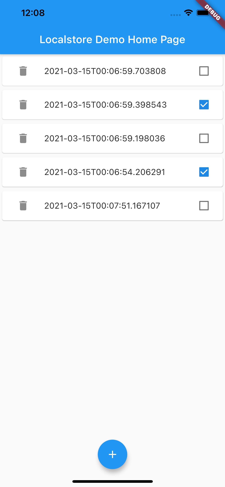

# Localstore Example

An example flutter project using Localstore.

## Getting Started
```dart
import 'package:flutter/material.dart';
import 'package:localstore/localstore.dart';

void main() {
  WidgetsFlutterBinding.ensureInitialized();
  runApp(MyApp());
}

class MyApp extends StatelessWidget {
  @override
  Widget build(BuildContext context) {
    return MaterialApp(
      title: 'Localstore Demo',
      theme: ThemeData(
        primarySwatch: Colors.blue,
      ),
      home: MyHomePage(title: 'Localstore Demo Home Page'),
    );
  }
}

class MyHomePage extends StatefulWidget {
  MyHomePage({Key? key, this.title}) : super(key: key);

  final String? title;

  @override
  _MyHomePageState createState() => _MyHomePageState();
}

class _MyHomePageState extends State<MyHomePage> {
  final _db = Localstore.instance;
  final _items = <String, Todo>{};
  @override
  void initState() {
    _db.collection('todos').stream.listen((event) {
      setState(() {
        final item = Todo.fromMap(event);
        _items.putIfAbsent(item.id, () => item);
      });
    });
    super.initState();
  }

  @override
  Widget build(BuildContext context) {
    return Scaffold(
      appBar: AppBar(title: Text(widget.title!)),
      body: ListView.builder(
        itemCount: _items.keys.length,
        itemBuilder: (context, index) {
          final key = _items.keys.elementAt(index);
          final item = _items[key]!;
          return Card(
            child: CheckboxListTile(
              value: item.done,
              title: Text('${item.title}'),
              onChanged: (value) {
                item.done = value!;
                item.save();
              },
              secondary: IconButton(
                icon: Icon(Icons.delete),
                onPressed: () {
                  setState(() {
                    item.delete();
                    _items.remove(item.id);
                  });
                },
              ),
            ),
          );
        },
      ),
      floatingActionButton: FloatingActionButton(
        onPressed: () {
          final id = Localstore.instance.collection('todos').doc().id;
          final now = DateTime.now();
          final item = Todo(
            id: id,
            title: now.toIso8601String(),
            time: now,
            done: false,
          );
          item.save();
          _items.putIfAbsent(item.id, () => item);
        },
        tooltip: 'add',
        child: Icon(Icons.add),
      ),
      floatingActionButtonLocation: FloatingActionButtonLocation.centerDocked,
    );
  }
}

/// Data Model
class Todo {
  final String id;
  String title;
  DateTime time;
  bool done;
  Todo({
    required this.id,
    required this.title,
    required this.time,
    required this.done,
  });

  Map<String, dynamic> toMap() {
    return {
      'id': id,
      'title': title,
      'time': time.millisecondsSinceEpoch,
      'done': done,
    };
  }

  factory Todo.fromMap(Map<String, dynamic> map) {
    return Todo(
      id: map['id'],
      title: map['title'],
      time: DateTime.fromMillisecondsSinceEpoch(map['time']),
      done: map['done'],
    );
  }
}

extension ExtTodo on Todo {
  Future save() async {
    final _db = Localstore.instance;
    return _db.collection('todos').doc(id).set(toMap());
  }

  Future delete() async {
    final _db = Localstore.instance;
    return _db.collection('todos').doc(id).delete();
  }
}
```
## Screen shot
